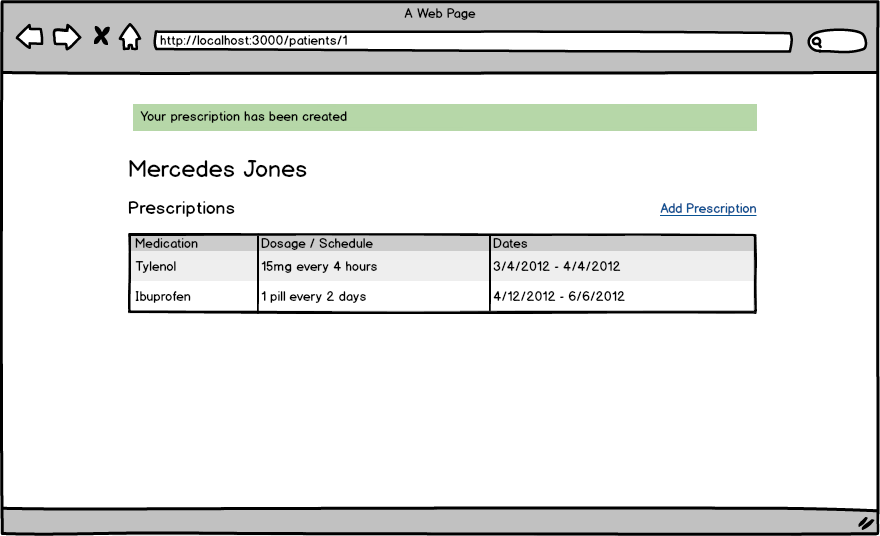

# Rails Practice

## Setup

* Fork and clone the repository
* Install gems - `bundle`
* Set up the databases - `rake db:create db:migrate db:seed`
* Start the server - `rails s`

You can run specs with:

`rspec`

Note: email/password combinations for existing users populated by `rake db:seed` can be found in the db/seeds.rb file.

## Stories

**Users can see a patient's list of prescriptions**

```
Given that I am on the index page
When I click on a patient's name
Then I see the patient page with an empty table of prescriptions
```

**Users can add prescriptions**

```
Given I am on the patient's show page
When I click on "Add prescription"
And I fill in the fields from the comp
Then a prescription is created with a flash message "Your prescription has been created" 
And you see the new prescription in the prescription table
```

**All fields for a prescription are required**

```
When I try to create a prescription
Then the system validates that all fields are required
And displays error messages as in the comp if they are missing
```

**Users can see prescriptions from the medications show page**

```
Given I am on the index page
And I click on the name of a medication
Then I see a list of people that have a prescription for that medication
```

**Dosage field must be a number**

```
When I try to create a prescription
And I try to add a non-numeric dosage amount
Then an error message is displayed
```

**End date cannot be before start date on prescriptions**

```
When the user enters an end date that is before the start date
Then the system displays a validation error that says
"End date must be after the start date"
```

## Wireframes

Index page


Patient show page



New prescription page


New prescription page w/ errors


Medication show page


