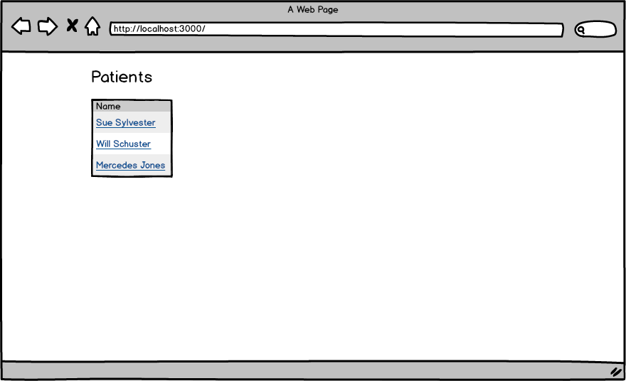
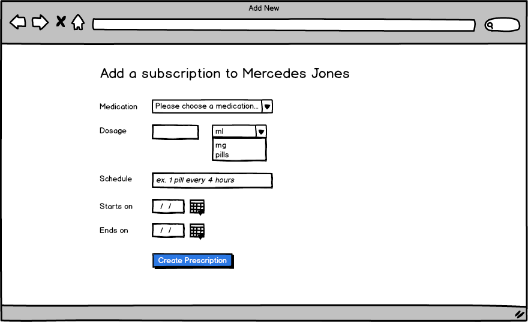
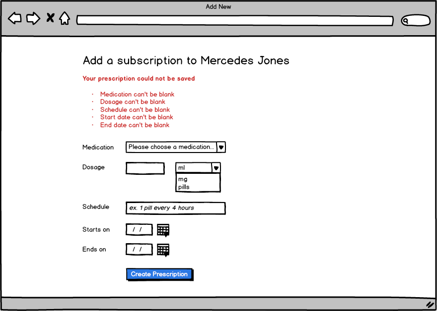
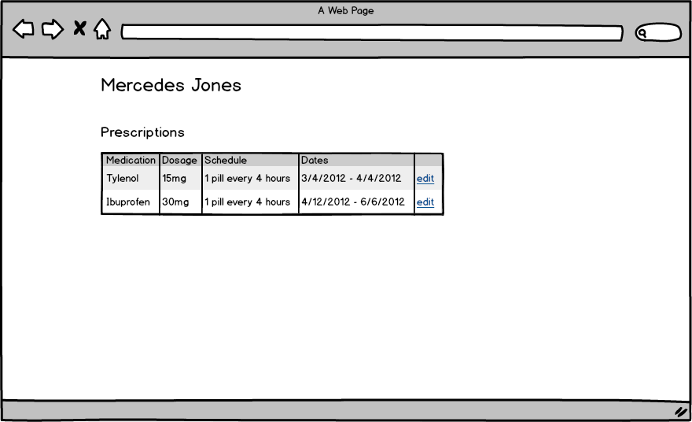
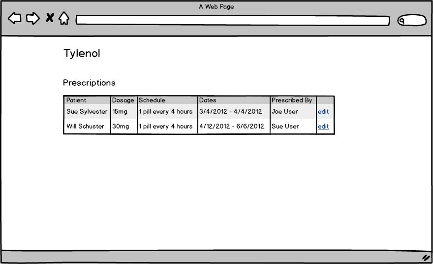

# Rails Practice

## Setup

* Fork and clone the repository
* Install gems - `bundle`
* Set up the databases - `rake db:create db:migrate db:seed`
* Start the server - `rails s`

You can run specs with:

`rspec`

Note: email/password combinations for existing users populated by `rake db:seed` can be found in the db/seeds.rb file.

## Stories

**Users can add prescriptions**

```
Create a patients show page
From the patients show page
Users can add prescriptions
All fields in prescriptions must be present
```

**Users can see prescriptions from the medications show page**

```
Create a medications show page
On that page, show all the prescriptions for that medication
```

**End date cannot be before start date on prescriptions**

```
If a user enters an end date before a start date
Display a validation error
```

## Wireframes

Index page



New prescription page



New prescription page w/ errors



Person show page



Person show page



## References

* [ActiveRecord Enum](http://api.rubyonrails.org/v4.1.0/classes/ActiveRecord/Enum.html)